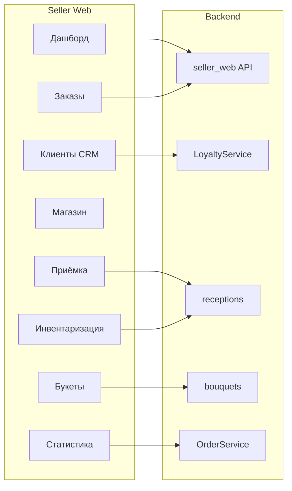

# Анализ seller web системы и предложения по улучшению CRM

## Текущая архитектура модулей

---

## 1. CRM (База клиентов)

**Что есть:** список клиентов (телефон, ФИО, номер карты, баллы), добавление клиента, карточка клиента, процент начисления баллов, ручное внесение продажи (сумма → начисление баллов), история транзакций (сумма, баллы, дата). В бэкенде есть `order_id` в транзакциях при начислении с заказа — но в UI не отображается.

**Недочёты и предложения:**

| Недочёт                     | Предложение                                                                                                                                               |
| --------------------------- | --------------------------------------------------------------------------------------------------------------------------------------------------------- |
| Нет связи «клиент ↔ заказы» | В карточке клиента показывать список заказов (из мини-приложения по телефону). Добавить переход к заказу из транзакции, если есть `order_id`.             |
| Нет списания баллов         | Реализовать «Списать баллы» (оплата части заказа баллами или ручное списание) — модель транзакции уже поддерживает отрицательные баллы при доработке.     |
| Нет заметок и тегов         | Поля «Заметка» к клиенту, опционально теги/сегменты (VIP, частый, новый) для фильтрации и рассылок.                                                       |
| Нет аналитики по клиенту    | В карточке: сумма покупок за период, средний чек, дата последнего заказа.                                                                                 |
| Нет экспорта                | Экспорт базы клиентов в CSV/Excel (телефон, ФИО, карта, баллы, дата регистрации).                                                                         |
| Дубликаты по телефону       | При добавлении клиента уже есть проверка дубликата (DuplicatePhoneError); в UI можно показывать «Клиент с таким телефоном уже есть» и ссылку на карточку. |

---

## 2. Приёмка

**Что есть:** справочник цветов (название, срок жизни по умолчанию), приёмки (название, дата), позиции приёмки (цветок, кол-во, дата прихода, срок жизни, цена за шт, остаток, проданные шт/сумма). Подсветка строк с истекающим сроком (≤2 дней). Удаление позиции.

**Недочёты и предложения:**

| Недочёт                      | Предложение                                                                                                                                                                                                                                                                                                                                     |
| ---------------------------- | ----------------------------------------------------------------------------------------------------------------------------------------------------------------------------------------------------------------------------------------------------------------------------------------------------------------------------------------------- |
| Нельзя редактировать позицию | Добавить редактирование количества (остаток), цены и срока жизни у существующей позиции (backend: `update_reception_item` уже есть в [backend/app/services/receptions.py](backend/app/services/receptions.py), проверить использование в [adminpanel/src/pages/seller/SellerReceptions.tsx](adminpanel/src/pages/seller/SellerReceptions.tsx)). |
| Нет статуса приёмки          | Поле «Закрыта» / «Открыта» — закрытая приёмка только для просмотра и инвентаризации, новые позиции только в открытую.                                                                                                                                                                                                                           |
| Нет поставщика/накладной     | Опциональные поля: поставщик, номер накладной — для отчётности и поиска.                                                                                                                                                                                                                                                                        |
| Массовое добавление          | Импорт позиций из CSV (цветок по имени/ID, кол-во, цена, дата) для ускорения приёмки.                                                                                                                                                                                                                                                           |

---

## 3. Инвентаризация — критический недочёт

**Что есть:** выбор приёмки, ввод фактического остатка по каждой позиции, кнопка «Сверить» — возвращается отчёт: расхождение по позициям и сумма убытка.

**Критический недочёт:** сервис [inventory_check](backend/app/services/receptions.py) только **считает** расхождения и возвращает отчёт. **Фактические остатки в БД не обновляются** (`remaining_quantity` не меняется). После «сверки» учёт остаётся прежним.

**Предложение:**

- Добавить второй шаг: после отображения результата сверки — кнопка **«Применить остатки»**.
- Новый endpoint, например `POST /seller-web/receptions/{reception_id}/inventory/apply` с телом `list[InventoryCheckLine]`: обновляет `remaining_quantity` по каждой позиции до `actual_quantity`, при необходимости фиксирует факт инвентаризации (отдельная таблица или поле `inventory_checked_at` по приёмке).
- В UI: после «Сверить» показывать результат и кнопку «Применить остатки» с подтверждением («Остатки в системе будут приведены в соответствие с введёнными. Продолжить?»).

---

## 4. Статистика продаж

**Что есть:** период (1 день, 7 дней, месяц, свой диапазон), график дневной выручки, общая выручка, комиссия 18%, к получению, разбивка по способу получения (доставка/самовывоз), заказы по статусам.

**Недочёты и предложения:**

| Недочёт                          | Предложение                                                                                                                     |
| -------------------------------- | ------------------------------------------------------------------------------------------------------------------------------- |
| Нет топа товаров/букетов         | Блок «Популярные товары/букеты» за период (по количеству заказов или выручке) — запросы к заказам и items_info или к агрегатам. |
| Нет среднего чека                | Средний чек за период (выручка / число заказов).                                                                                |
| Нет сравнения с прошлым периодом | «За тот же период ранее»: выручка и число заказов тогда vs сейчас, в % (например, «+15% к выручке»).                            |
| Нет экспорта                     | Экспорт отчёта (таблица по дням, итоги) в CSV/Excel или PDF.                                                                    |

---

## 5. Заказы

**Что есть:** вкладки «Запросы на покупку», «Активные заказы», «История», фильтр по датам. Принятие/отклонение, смена цены, смена статуса (принят → собирается → в пути → выполнен).

**Недочёты и предложения:**

| Недочёт                       | Предложение                                                                                                                                                                                                     |
| ----------------------------- | --------------------------------------------------------------------------------------------------------------------------------------------------------------------------------------------------------------- |
| Нет детальной карточки заказа | Отдельная страница/модалка «Заказ #N»: полные данные покупателя (ФИО, телефон, адрес), разбор товаров по строкам (название, кол-во, цена), история смены статуса.                                               |
| Связь с CRM                   | В карточке заказа показывать «Клиент по программе лояльности» (если телефон совпал с клиентом) и ссылку на карточку клиента; при завершении заказа баллы уже начисляются через `accrue_points_for_buyer_phone`. |
| Нет печати/этикетки           | Кнопка «Печать» или «Этикетка для сборки» — печатная форма с адресом, составом, комментарием.                                                                                                                   |
| Нет массовых действий         | Выбор нескольких заказов и действие «Отметить как собранные» / «В пути» для ускорения обработки.                                                                                                                |

---

## 6. Дашборд продавца

**Что есть:** счётчики (запросы на покупку, активные заказы, выполнено, выручка, к получению, лимит), ссылки на заказы, настройки магазина, статистику.

**Недочёты и предложения:**

| Недочёт                       | Предложение                                                                                                            |
| ----------------------------- | ---------------------------------------------------------------------------------------------------------------------- |
| Нет алертов по остаткам       | Блок «Внимание»: букеты, которые скоро нельзя собрать (мало цветов в приёмках), или товары с нулевым остатком.         |
| Нет алертов по сроку годности | Цветы с истекающим сроком (например ≤2 дней) по приёмкам — список и ссылка на приёмку.                                 |
| Нет быстрых действий          | Кнопки «Новый заказ» (если есть офлайн-продажа), «Приёмка», «Добавить клиента» — сокращение шагов до частых сценариев. |

---

## Приоритизация (рекомендуемая)

1. **Высокий приоритет:** применение остатков после инвентаризации (критический функционал).
2. **Высокий:** связь клиент ↔ заказы в CRM и в карточке заказа; списание баллов (если нужно для программы лояльности).
3. **Средний:** редактирование позиции приёмки; детальная карточка заказа; топ товаров/букетов и средний чек в статистике.
4. **Средний/низкий:** заметки и теги к клиентам; экспорт клиентов и отчётов; фото букета; алерты на дашборде.
5. **Низкий:** дублирование букета, категории букетов, поставщик/накладная в приёмке, массовый импорт приёмки, массовые действия по заказам, печать этикетки.

---

## Технические точки входа

- **Backend:** [backend/app/api/seller_web.py](backend/app/api/seller_<｜tool▁call▁end｜><｜tool▁calls▁end｜>

